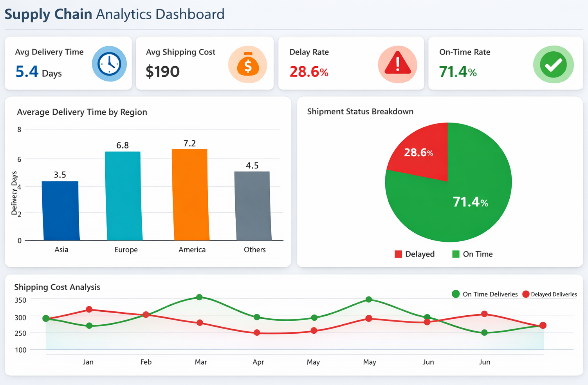

# Supply Chain Analytics Project

This project analyzes supply chain shipment and delivery data to identify delays, cost inefficiencies, and operational performance. The insights help businesses improve logistics efficiency and make data-driven decisions.

---

## Features
- Clean and preprocess raw supply chain data
- Calculate delivery time and delays
- Analyze shipping costs and operational performance
- Generate visualizations for key metrics
- Dashboard-ready output (saved as PNG)

---


## Output screenshot 

Here is a output chart generated by the project:



**Explanation:**  
- **Bar Chart:** Average delivery days per region  
- **KPIs:** Avg delivery time, delay rate, shipping cost (console output)  
- **Business Use:** Quickly identifies slow regions or expensive shipments for decision-making  

---

## Tech Stack
- Python
- Pandas
- Matplotlib
- (Optional) Power BI / Tableau for enhanced dashboards

---


---

## How to Run

1. Clone the repository
2. Install required packages:
```bash
pip install -r requirements.txt

Run the project:
python main.py
